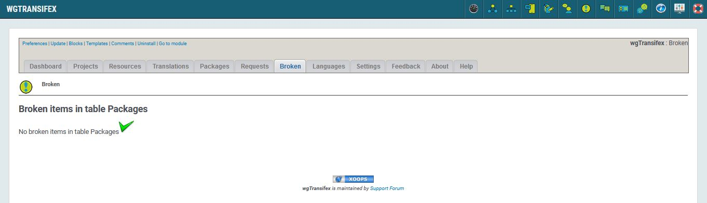
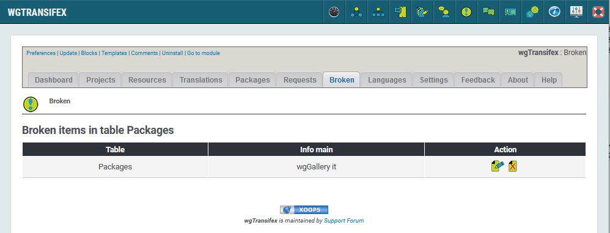

# Broken

## 1. No broken packages

_Figure 8a: No broken \(Admin side\)_

If a package is notified as broken (download is not possible) then you will see it here in the list.

## 2. Broken packages

_Figure 8b: List of broken packages \(Admin side\)_