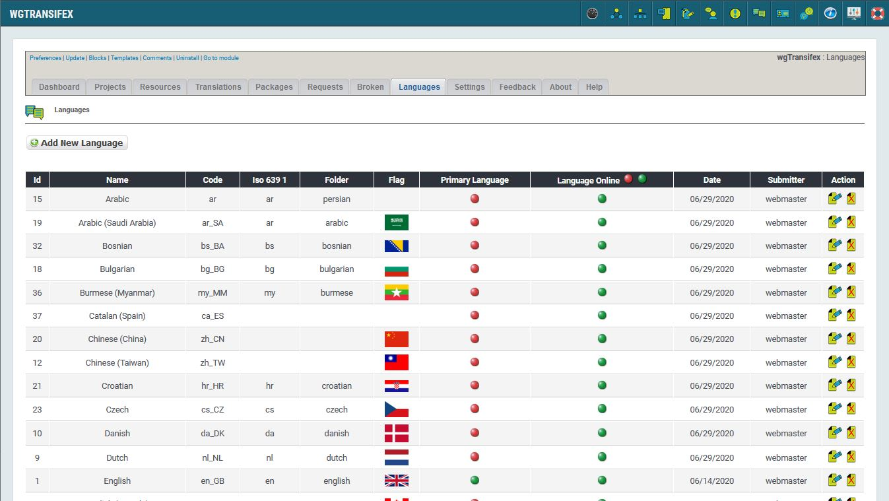

# Languages

## 1. Overview

_Figure 9: Languages \(Admin side\)_

In the Languages tab, you can see all your languages.

## 2 Information

### Primary language
Select the language, which should be your primary language in the forms for download, packages and so on.

### Language online
Define which languages should be available in the forms and on user side.
