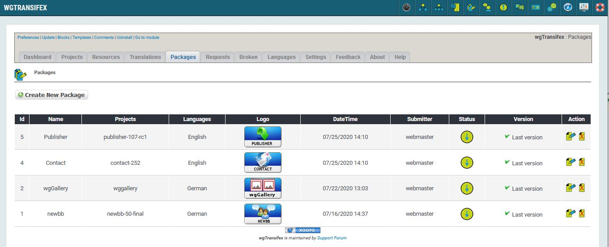
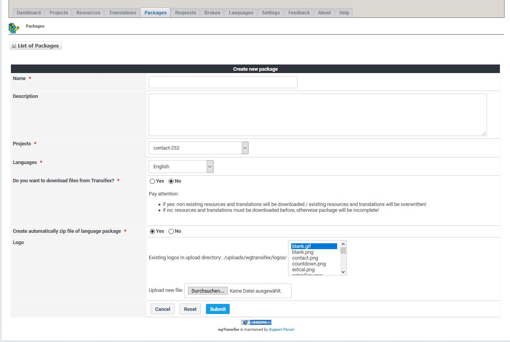

# Packages

_Figure 6a: List of packages \(Admin side\)_

On packages tab you see the list of currently available packages.

For more details about 'Status' please look on page [Status](status.md)

_Figure 6b: Create package \(Admin side\)_

If you want to create a package you have to select a project and the language.

You can decide whether you want to download data from Transifex for the creation or use already existing data.

Pay attention:

   * if yes: non existing resources and translations will be downloaded / existing resources and translations will be overwritten!
   * if no: resources and translations must be downloaded before, otherwise package will be incomplete!
   
You can also decide whether you want to create immediately a zip file, which will be provided for download on user side.