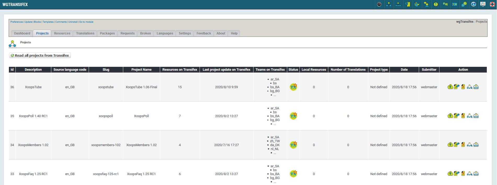

# Projects

## 1. Overview

_Figure 3: Projects on Transifex \(Admin side\)_

You see an overview of the projects you have already read from transifex.

For more details about 'Status' please look on page [Status](status.md)

 you can read details for this project from transifex

 you can edit details for this project

 you can delete a project

 you can show resources of this project
