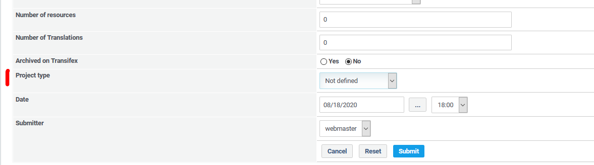

# Projects

## 1. Overview

_Figure 3: Projects on Transifex \(Admin side\)_

You see an overview of the projects you have already read from transifex.

### Status of a project

For more details about 'Status' please look on page [Status](status.md)

 you can read details for this project from transifex

 you can edit details for this project

 you can delete a project

 you can show resources of this project

### Project type

The project status is only important, if you want to upload resources to Transifex (Attention: you need specific permissions on Transifex for this operation).

Depending on this type the folder structure of the language package will be created (see also [Resources](2administration/resources.md)).

Possible types:

   * Not defined
   * Upload from module: select this type, if you want to read the language files of a specific module, existing in current XOOPS environment
   * XOOPS Core: select this type, if you want to upload the XOOPS Core languange files
