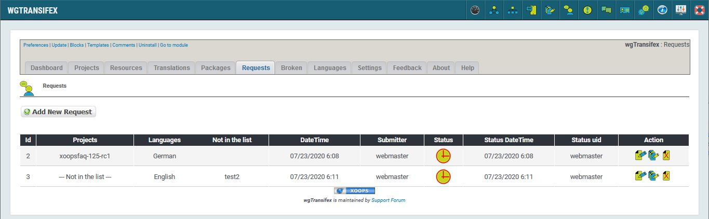

# Requests

## 1. Overview

_Figure 7: Requests List \(Admin side\)_

In this tab you can see list of requests for new packages, made by your website users.

For more details about 'Status' please look on page [Status](status.md)

 you can directly goto packages creation