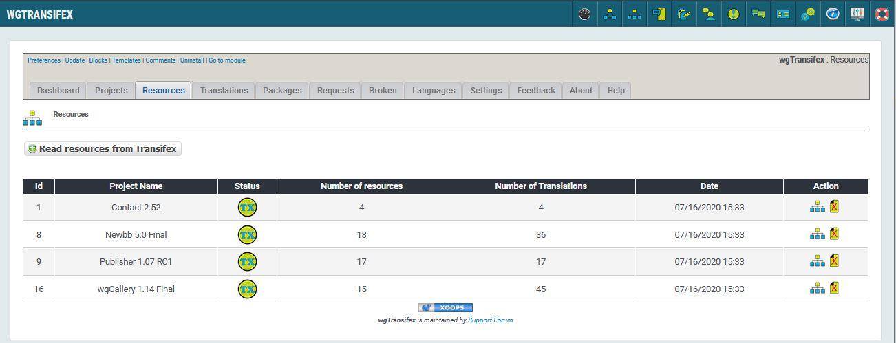
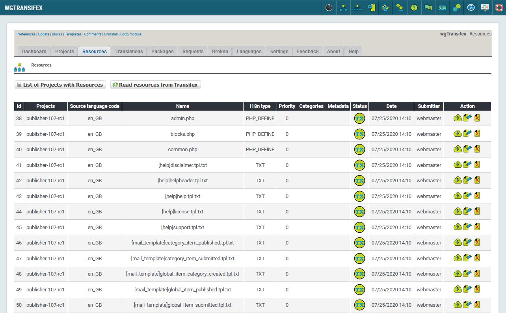

# Resoruces

## 1. Overview

_Figure 4a: Resources projects list \(Admin side\)_

In this tab you can see list of projects where resources are already existing.

For more details about 'Status' please look on page [Status](status.md)

 you can show resources of this project

## 2. List of resources

_Figure 4b: Resources List \(Admin side\)_

Here you see a list of existing resources of selected project.

 you can read details this resource from transifex

 you can edit details of the resource

 you can delete the resource
