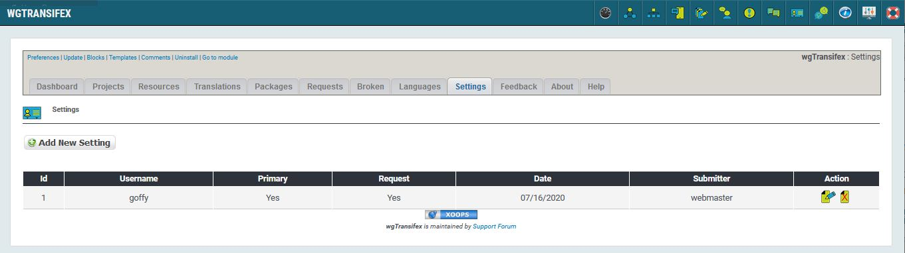

# Settings

In the tab 'Settings' you can store different setting for access to tranisfex.

_Figure 10: List of settings \(Admin side\)_

Please ente user name and password of your transifex account.

Primary: Type 'Primary' should be used by admins*

Request: If you have an own transifex account for user requests then select 'Yes'

