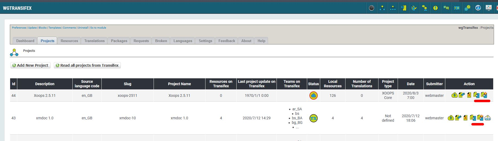
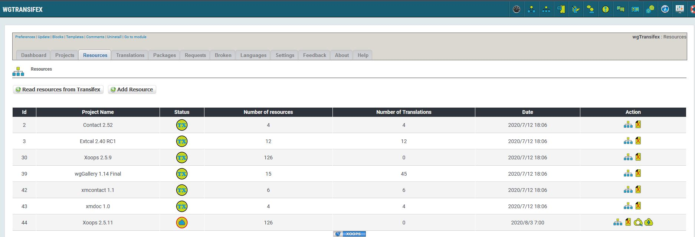
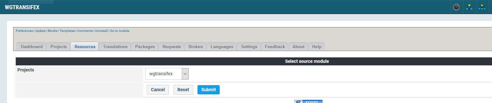
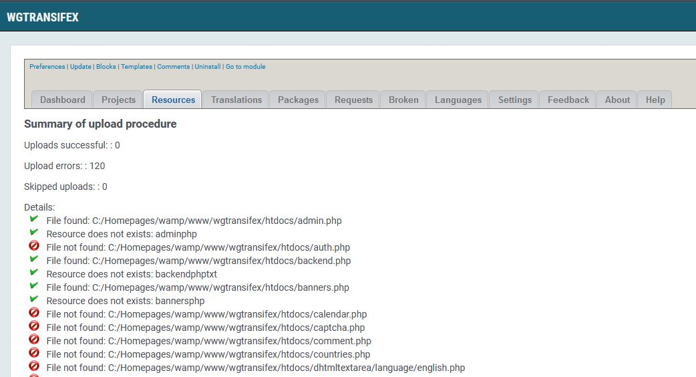
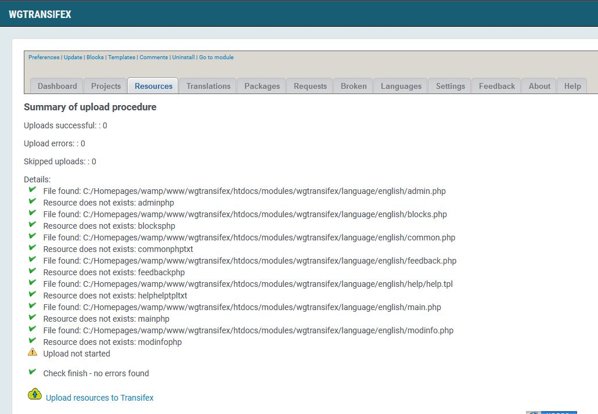
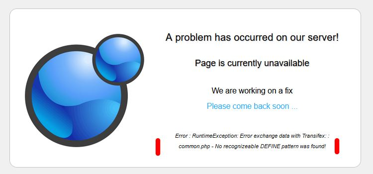
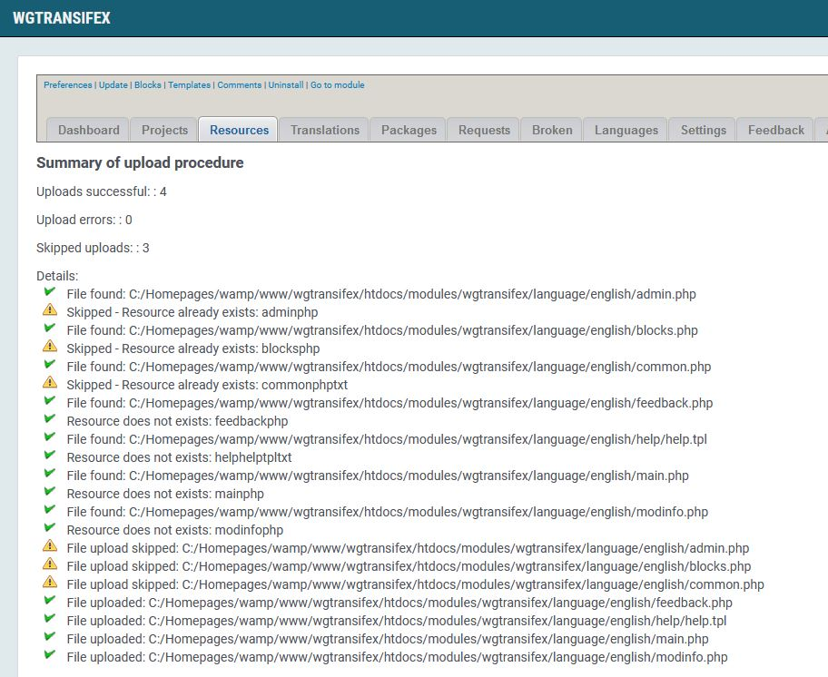

# Tools for TX Admins

For Transifex admins are different additional tools available.

Basically it would be possible to create also the project itself, but as we need to make different setting for Translation manager it is necessary that you create the project first, and then you can upload all related files.

Transifex admins have the possibility to define the resources for a project locally and upload all the files in bulk. Therefore it isn't necessary to do this manually file by file.

## Preferences

In order to activate/show the tools set in preferences 'Show Tx Admin Tools' to 'Yes'. Activate only, if you have admin permission in Transifex, otherwise the procedures running into an error.

## Tools

### Projects

On tab 'Projects' you find now the possibility

   *  to copy resource data from one project to another one
   *  to copy resource data from one project to a new one
   *  to read all files of english language folder from a moduleas resource data 

If you create a local project for upload you have to define whether this is a project for module files or the XOOPS Core. This is necessary to find the proper starting directory for uploading the file.

The new local project must have status  'Local data'.

All files must exist in your current XOOPS environment.

### Resources

On tab 'Resources' you find now the possibility to test the resources and to upload the resources.

 During testing the resources following will be done:

    * Check whether the files are available or not
    * Check whether the resource is already available on transifex

If project type is 'Upload from module' you have to select the module

If project type is 'XOOPS Core' then starting directory is the current XOOPS root directory.

As a result you get a list of check result

**Attention: Do not start the upload before all checks are successfully.**

If a problem or an error occure during upload procedure you get a error message

This error message contains the file and the reason, e.g. like in example: file common.php doesn't hat PHP DEFINE structure.
Please check the file and resource data and restart upload.

If upload is successful you get result list:

