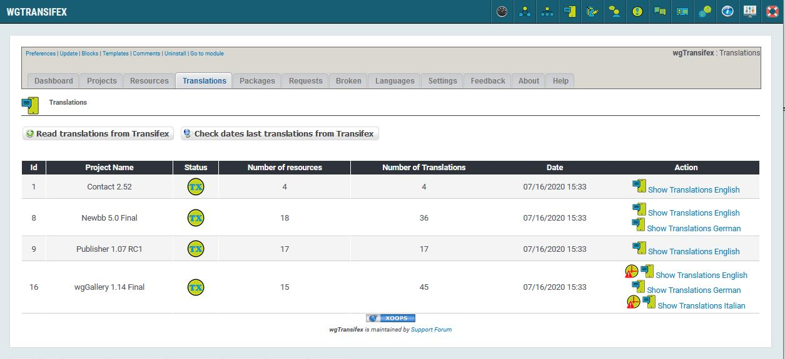
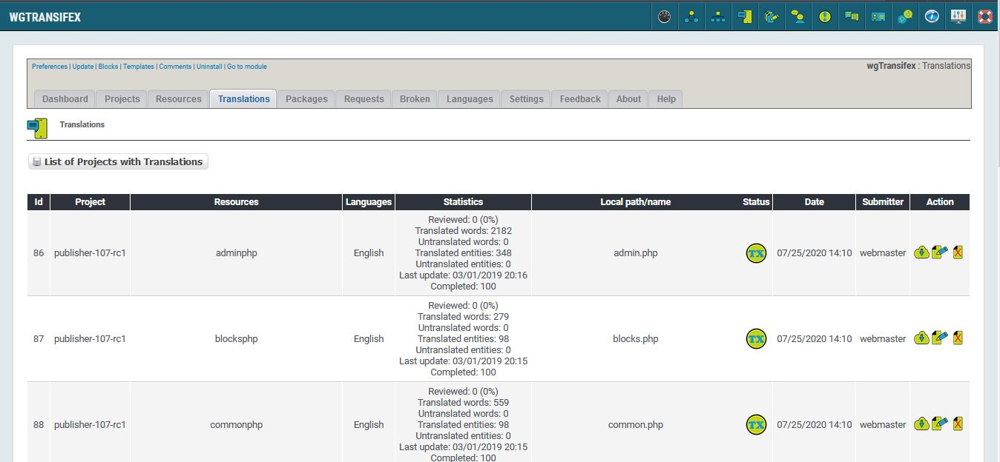

# Translations

## 1. Overview

_Figure 5a: Translations project list \(Admin side\)_

Here you can see the project, for which you have translated resources.

You see also which language are already existing.

For more details about 'Status' please look on page [Status](status.md)

## 2. List of translations

_Figure 5b: Translations list \(Admin side\)_

Here you can see a list of all translated resources.

 you can read the translation for this resource from transifex

 you can edit the translation

 you can delete the translation