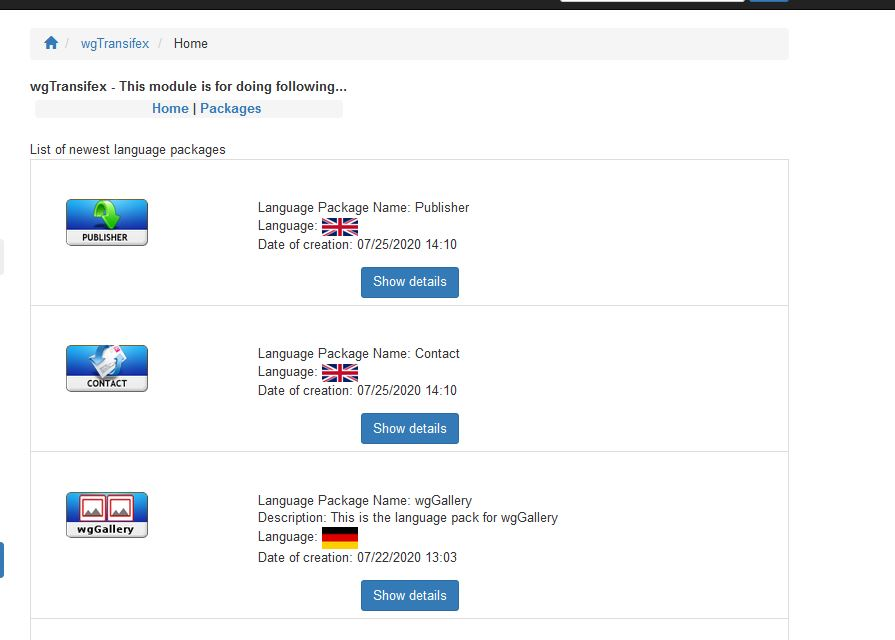
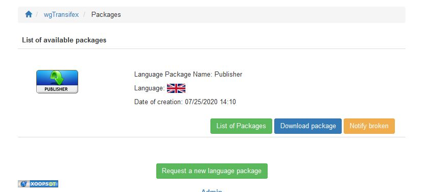
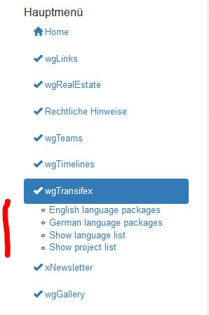

# The User Side

## 1. Overview

In the overview you get a list of newest language packages.

## 2. Packages

If you goto details you get the details and a button to download the language package.

If download is not working the users can notify website owner about broken package.

If a language package is not available for the moment the users can send a request to website owner.

## 2. Main menu

In the main menu you can see a list of all languages for which a language package is available.

You can also show the list of languages in current wgTransifex module.

You can also show the list of project currently existing in Transifex.
