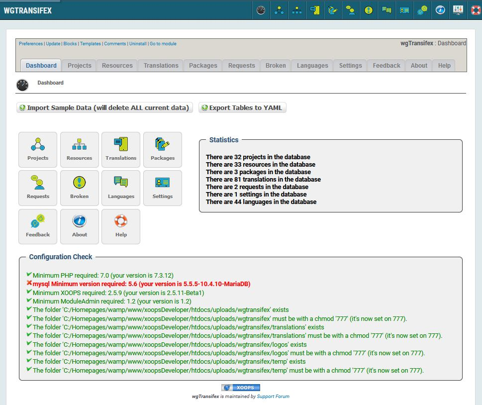

# Introduction

## wgTransifex Tutorial

#### for XOOPS 2.5.11

### User Manual

© 2020 XOOPS Project \([www.xoops.org](https://xoops.org)\)

### Module Purpose

This module is for downloading translations from Transifex, and downloaded files can be provided as a language package.

_Figure 1: Main view of the wgTransifex \(Admin side\)_

### Download/Fork the Module 

**You can fork the module --&gt;** [**here**](https://github.com/XoopsModules25x/wgtransifex)**\)**

### How to Contribute

[You can contribute on GitHub](https://github.com/XoopsDocs/wgtransifex-tutorial). 
Changes will be [pushed to Gitbook.io automatically](https://www.gitbook.com/book/xoops/wgtransifex-tutorial/activity) 
when the [main repository](https://github.com/XoopsDocs/wgtransifex-tutorial) changes.

Editing the book can be done either by updating the markdown files with a text editor, or opening the repository in [the Gitbook desktop app](https://github.com/GitbookIO/editor/blob/master/README.md). The desktop app will give you a live preview option.

## Table of Content

* [Install/Uninstall](1install.md)
* [Administration Menu](2administration/)
* [Preferences](3preferences.md)
* [Operating Instructions](4operations.md)
* [The User Side](5userside.md)
* [Blocks](6blocks.md)
* [Templates](7templates.md)
* [Module Credits](9credits.md)
* [About XOOPS CMS](10aboutxoops.md)

### License:

  
Unless specified, this content is licensed under a [Creative Commons Attribution-NonCommercial-ShareAlike 4.0 International License](http://creativecommons.org/licenses/by-nc-sa/4.0/).

All derivative works are to be attributed to XOOPS Project \([www.xoops.org](https://xoops.org)\)

